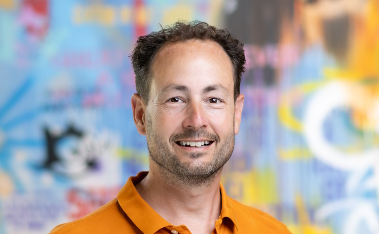

## Hi 👋

I'm Fokko! I have a background as a C# developer at multiple employees, but since 2011 I'm involved in everything around Application Lifecycle Management and more specifically DevOps patterns and practices. It is my dream to transform a company using these patterns and practices, using my experience and of course using GitHub 😁. My current job is DevOps Consultant at [Xebia 💜](https://www.xebia.com), where I help customers adopt DevOps Patterns and practices.

## 💬 Ask me about

You can ask me anything about Azure DevOps. I have worked with Azure DevOps since its birth in 2005, when it used to be called Visual Studio Team System. Furthermore I'm working on my proficiency in everything around GitHub.

## Details

😄 Pronouns: He/Him
⚡ Fun fact: I love to work on my classic car (a 1979 Mini)
